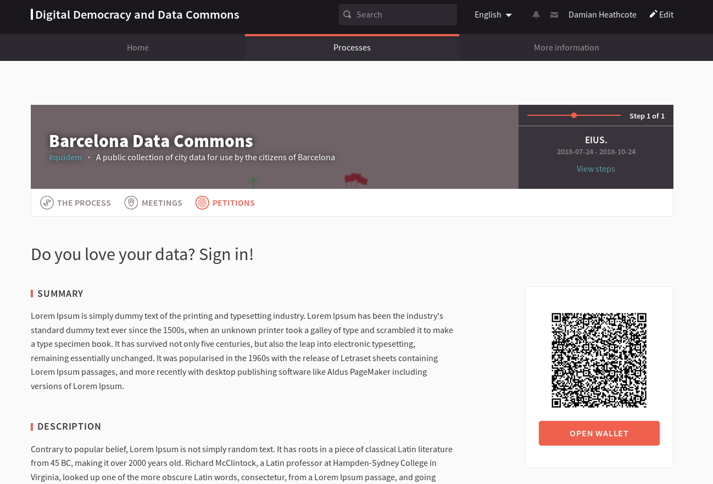

# Digital Democracy and Data Commons for Barcelona

This is the open-source repository for DDDC, based on [Decidim](https://github.com/decidim/decidim),
implementing the [DECODE](https://decodeproject.eu/) prototypes.


## Setting up the application

### Development

You will need to do some steps before having the app working properly once you've deployed it:

1. Clone this repository:
```console
git clone https://github.com/alabs/DDDC
```
2. Go to the directory:
```console
cd DDDC
```
3. Install the gems:
```console
bundle install
```
4. Set up the database. If you need you can change your settings using the environment variables from config/database.yml:
```console
rails db:create
rails db:migrate
rails db:seed
```
5. Start the web server:
```console
rails server
```

### Production

You should deploy it as other Ruby on Rails applications, using Capistrano or other methods for deployment that you prefer.

As a dependency it needs the [decidim-decode-connector](https://github.com/DECODEproject/decidim-decode-connector) on the same server.

TODO: how to configure the local route on Decidim configuration.

## About petitions module

We implemented the DECODE prototypes based on a Decidim module. It's on the `decidim-petitions/` directory.

### Configuring

Go to the /admin, configure a new Participatory Process, add Petition component and configure a Petition.

You can set up the Chainspace URI here.

### Screenshots




### GraphQL

It's important to configure the JSON attributes so it's consumed by other apps from DECODE ecosystem:

```json
{
  "mandatory": [
    {
      "predicate": "schema:addressLocality",
      "object": "Barcelona",
      "scope": "can-access",
      "provenance": {
        "url": "http://atlantis-decode.s3-website-eu-west-1.amazonaws.com"
      }
    }
  ],
  "optional": [
    {
      "predicate": "schema:dateOfBirth",
      "object": "voter",
      "scope": "can-access"
    },
    {
      "predicate": "schema:gender",
      "object": "voter",
      "scope": "can-access"
    }
  ]
}
```

To consume this data, you can do it on the GraphQL API:

```graphql
{
  petition(id:"1") {
    id,
    title,
    description,
    author,
    json_schema
  }
}
```


