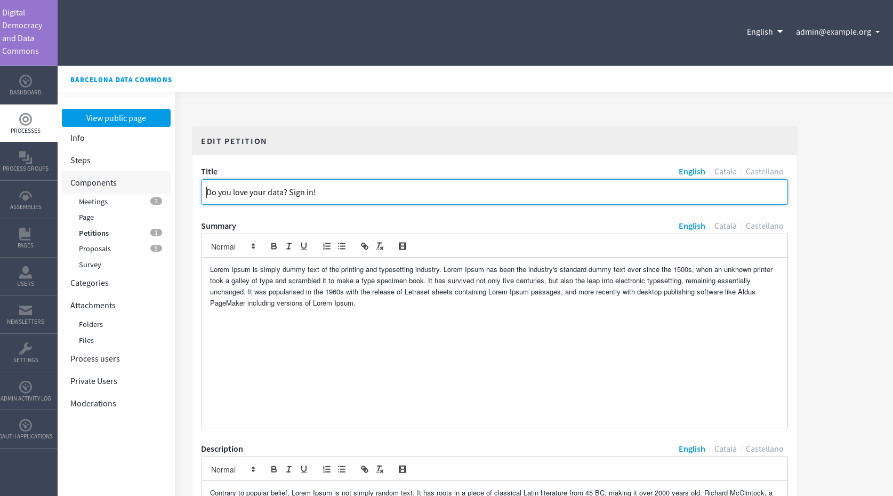
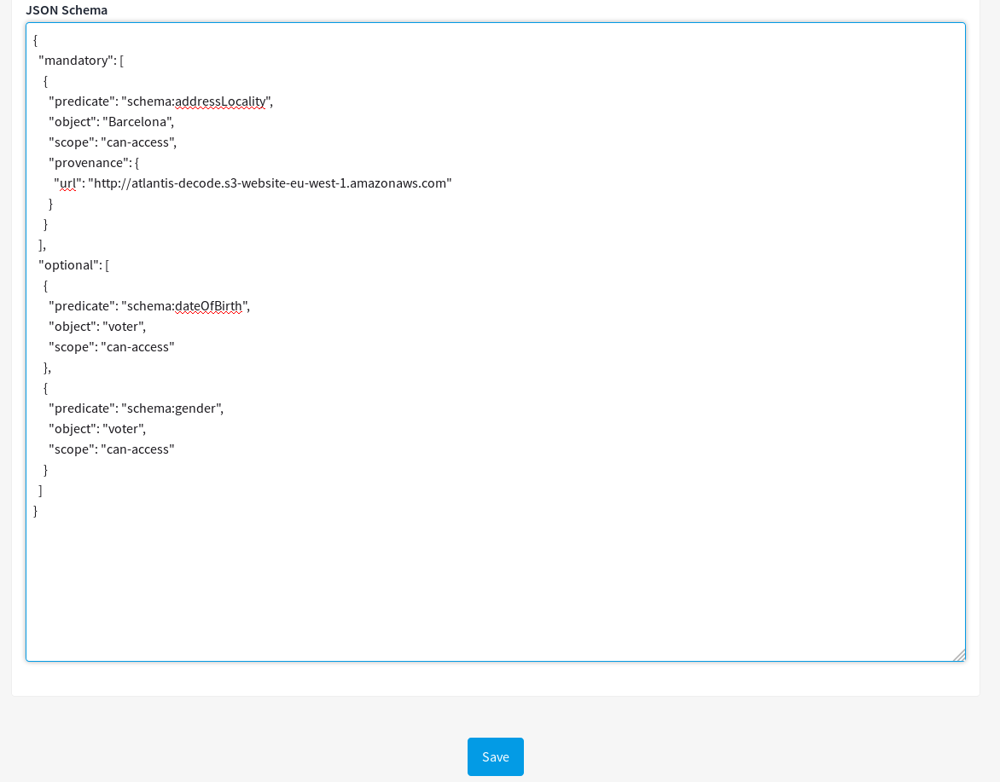
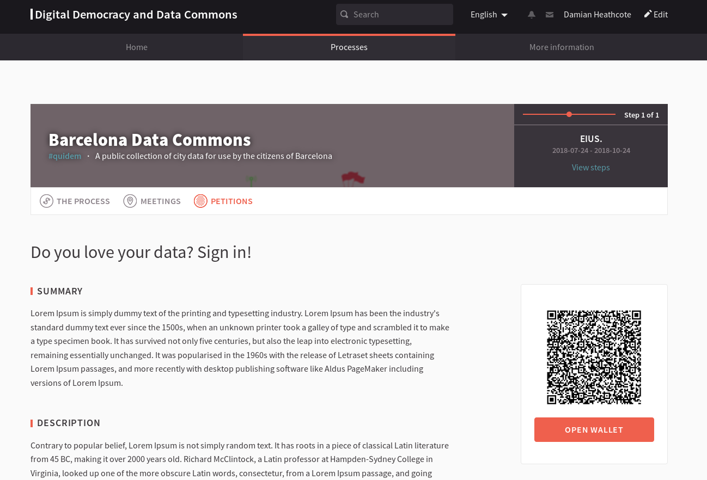

# Decidim::Petitions

Add the functionality to work with DECODE petitions.

## Usage

Petitions will be available as a Component for a Participatory
Space.

## Installation

Add this line to your application's Gemfile:

```ruby
gem 'decidim-petitions', git: 'https://github.com/decodeproject/decidim-module-petitions'
```

Execute these commands:

```bash
bundle install
rails decidim_petitions:install:migrations
rails db:migrate
```
And finally restart your web server. 

## Dependencies

* [dddc-credential-issuer](https://github.com/DECODEproject/dddc-credential-issuer). Configures URL, user and password at Petitions component panel. 
* [dddc-petitions](https://github.com/DECODEproject/dddc-petition-api).  Configures URL, user and password at Petitions component panel.
* [bcnnow](https://github.com/DECODEproject/bcnnow). Configures URL at Petitions component panel. 
* [decode-mobile-app](https://github.com/DECODEproject/decode-mobile-app). Should be configured to access the URL of the Decidim instance.
* [zenroom](https://github.com/DECODEproject/zenroom). Binary self contained on `bin/zenroom-static`. You can download the binary from [Dyne.org](https://sdk.dyne.org:4443/view/decode/):

```bash
wget https://sdk.dyne.org:4443/view/decode/job/zenroom-static-amd64/lastSuccessfulBuild/artifact/src/zenroom-static -O bin/zenroom-static
```

### Screenshots






## Configuration

There are some special JSON fields that need to be configured for working with DECODE ecosystem (json_schema, json_attribute_info, json_attribute_info_optional). You can see examples on [lib/decidim/petitions/component.rb](seeds).

## Contributing

See [Decidim](https://github.com/decidim/decidim).

## License

This engine is distributed under the GNU AFFERO GENERAL PUBLIC LICENSE.
